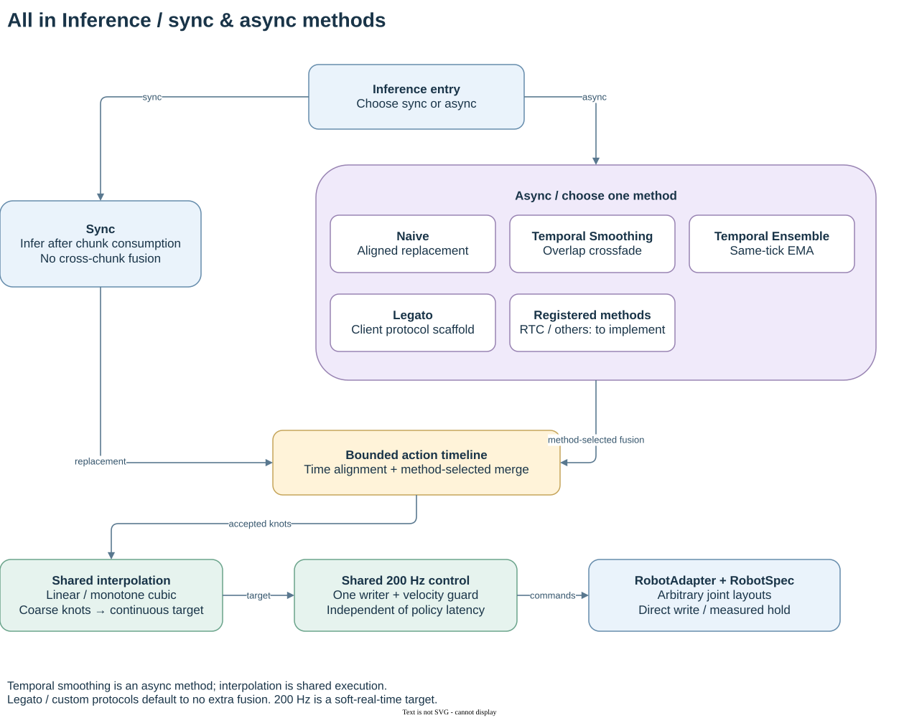

<div align="center">

# All in Inference

**从 action chunk 到连续控制：temporal smoothing × 独立 200 Hz 执行**

Model-agnostic · Embodiment-independent · Sync / Async · NumPy only

[快速开始](#快速开始) · [框架与接口](docs/ARCHITECTURE.md) · [接入现有推理与机械臂](docs/INTEGRATION.md) · [验证记录](docs/VALIDATION.md)

</div>

把低频策略输出接到高频机械臂控制，不应要求重写整套推理代码。本仓库将**策略调用、同步/异步调度、跨 chunk 平滑、连续插值、控制时钟、硬件适配**拆成可独立迭代的模块。

源自已有 inference 系统及 [RoboRSI](https://github.com/Srt-tian/RoboRSI_v1) 的 Piper 连续执行经验，以全新通用实现整理。**当前版本通过离线与模拟执行验证；新框架尚未完成真机验收。** 默认 CLI 只运行模拟器，不连接 CAN、不使能电机。



框架图由 `drawio-skill` 工作流生成：[可编辑 draw.io](docs/assets/architecture.drawio) · [PNG](docs/assets/architecture.png) · [生成脚本](scripts/draw_architecture.py)。

## 解决什么问题

| 层 | 职责 | 当前实现 / 扩展方式 |
| --- | --- | --- |
| Policy | 调用模型并解码动作 | `Policy`、`CallablePolicy`、`JointCodec`；接任意 SDK / HTTP / WebSocket 客户端 |
| Schedule | 何时请求、结果放在什么时间 | `AsyncSchedule` / `SyncSchedule`；实现两个方法即可新增调度 |
| Timeline | 新旧预测对齐与合并 | `replace`、`temporal` 渐变、`ensemble` 指数滑动融合 |
| Interpolation | 离散 action → 连续目标 | 线性 / 单调三次 Hermite；按轴决定是否混合 |
| Control | 按时下发、限制命令步长 | 独立 200 Hz 时钟、速度限制、跳过错过的时槽、状态/推理超时 |
| RobotAdapter | 读反馈、直接写命令、保持 | `SimRobot` / `CallbackRobot`；不绑定 Piper 或固定 14 维 |
| Report | 保存可追踪证据 | 内存有界记录；执行后写 JSON / CSV，不在控制环中同步 Web |

**Temporal smoothing 和 high frequency 是两回事。** 前者解决新旧预测切换，插值层生成连续目标，高频控制器按独立时钟真正下发。把数组插得更密，并不自动获得 200 Hz 控制。

## 快速开始

Python 3.10+；核心只依赖 NumPy。以下命令均在仓库根目录执行：

```bash
git clone https://github.com/Srt-tian/All_in_inference.git
cd All_in_inference
python3 -m venv .venv
source .venv/bin/activate
python -m pip install -e '.[dev]'

# 双臂 6+6 关节及两夹爪，异步策略，200 Hz 控制，运行 5 秒
all-in-inference --config examples/dual6_async.json --duration 5 --output outputs/dual6

# 单臂 7 关节及夹爪，同步 chunk 模式
all-in-inference --config examples/single7_sync.json --duration 5 --output outputs/single7

python -m unittest discover -s tests -v
```

未安装包时也可 `PYTHONPATH=src python -m all_in_inference.cli ...`。示例关节范围仅供模拟，**不能直接作为具体机械臂的安全配置**。

若系统 Python 缺少 `ensurepip/venv`，也可使用 `uv venv --python 3.10` 与 `uv pip install -e '.[dev]'`。独立安装、27 项测试及四种构型的模拟测量见[验证记录](docs/VALIDATION.md)。

每次运行生成：

```text
outputs/dual6/
├── summary.json   # 实测频率、间隔 P99、超时、过期动作数、推理延迟
└── commands.csv   # 命令时间、调度迟到量、缺帧状态、命令和观测关节位置
```

这两个文件在执行结束后生成。统计窗口有界，超过容量会记录丢弃计数。`measured_hz` 是主机命令调用的实测频率，不能代替 CAN 到达率或电机内部伺服频率。

## 三个频率分别配置

```json
{
  "runtime": {
    "action_hz": 25,
    "control_hz": 200,
    "observation_hz": 50,
    "smoothing": "temporal",
    "interpolation": "cubic"
  },
  "schedule": {"kind": "async", "inference_hz": 5}
}
```

- `action_hz`：模型输出相邻 action 对应的时间间隔。必须与训练/模型语义一致。
- `inference_hz`：异步请求的最高启动频率；只有一个在途请求，慢模型不会堆积请求。
- `control_hz`：主机下发频率，默认 200 Hz，与推理是否阻塞解耦。
- `observation_hz`：反馈采样目标频率；相机可以通过 adapter 提供独立缓存。

提高 `control_hz` 不会加快任务播放；调大 `action_hz` 会改变轨迹速度和模型时间语义。两者不要混用。

## 同步、异步和平滑怎么选

| 选项 | 时间语义 | 适用情形 |
| --- | --- | --- |
| `SyncSchedule` | 消耗当前 chunk 后请求；结果从到达后的下一个 action tick 开始 | 基础策略接入、静态等待式推理 |
| `AsyncSchedule` | 执行时持续请求；结果保留请求时刻的 tick 对齐，删除已过期前缀 | 有未来 action horizon 的连续推理 |
| `replace` | 新 chunk 接管对应未来区间 | 已由模型完成连续性处理、对照实验 |
| `temporal` | 同一目标 tick 上，新预测权重从 0 逐步增至 1 | 缓和新旧 chunk 切换，默认选择 |
| `ensemble` | 同一目标 tick 上做 EMA，默认新预测权重 0.6 | 希望多次预测融合，允许引入滞后 |

两种调度都保留独立控制循环。同步模式等待推理时保持最后下发位置，**不表示阻塞 200 Hz 写线程**。时间轴消费完毕也不等于物体抓取完成；任务成功应由上层反馈判断。

原 inference 的 `temporal_ensembling` 还包含按预测次序计算指数权重的版本；这里的 `ensemble` 明确指 EMA，**不宣称数值等价**。详细差异见[来源与迁移](docs/PROVENANCE.md)。

## 适配不同机械臂

`RobotSpec` 决定动作布局，没有写死左/右臂索引。支持不同数量的 revolute / prismatic / discrete 轴，通过名称映射模型顺序，通过 group 表达单臂、双臂或升降轴。

```python
from all_in_inference import Joint, RobotSpec, Runtime, RuntimeConfig, AsyncSchedule
from all_in_inference.adapters import SimRobot, SinePolicy

spec = RobotSpec("my-7dof", tuple(
    Joint(f"joint_{i}", lower=-2.5, upper=2.5, max_velocity=0.5)
    for i in range(7)
))
robot = SimRobot(spec, initial=[0] * 7)
policy = SinePolicy(spec, initial=[0] * 7)
runtime = Runtime(robot, policy, RuntimeConfig(control_hz=200), AsyncSchedule(5))
result = runtime.run(duration=5)
print(result["measured_hz"])
```

接真机时替换 `RobotAdapter`，接新模型时替换 `Policy`。`JointCodec` 可统一关节顺序、角度/长度单位、仿射反归一化及 observation-relative action。**末端位姿、IK、碰撞规划和力控不是当前核心的职责**；应在策略解码或机械臂专用模块中完成后，输出绝对关节目标。

已有 inference 的 high-follow worker 与这里的控制器只能有一个拥有写权限，不能把本框架 200 Hz 输出再塞进旧的插值队列。可落地的迁移步骤和 Piper 方法映射见 [INTEGRATION.md](docs/INTEGRATION.md)。

## 代码导航

```text
src/all_in_inference/
├── types.py          # RobotSpec / Observation / Request / ActionChunk / Protocols
├── codecs.py         # 模型坐标、单位及 joint order 转换
├── adapters.py       # 模拟器、回调硬件接口、策略客户端桥接
├── scheduling.py     # 同步 / 异步策略，后续调度扩展点
├── timeline.py       # 过期丢弃、跨 chunk 融合、连续目标采样
├── control.py        # 逐轴速度限制
├── runtime.py        # 三个执行角色、故障传播、停止与保持
├── report.py         # 执行后导出
└── cli.py            # 仅模拟的入口
examples/             # 单 6 轴、双 6 轴、单 7 轴、混合轴配置及桥接示例
tests/                # 时间对齐、平滑、时序、停止、解码与构型测试
docs/                 # 设计、接入、验证、路线图与框架图
```

## 边界与下一步

200 Hz 是 Python/Linux 下可测量的软实时目标，不是硬实时承诺。当前三次插值在固定 knot 序列内部保持一阶连续；chunk 在线替换及速度限制可能改变导数。当前限制命令速度，**未实现全程加速度/jerk 约束、碰撞检测或总线故障保护**。

停止会停止策略消费、清空时间轴，并尝试对新鲜实测位置发送一次保持命令，保留扭矩与夹爪状态；不自动回零、松爪或断使能。适配器必须提供有超时的 I/O；Python 不能抢占卡死的驱动调用。

后续重点是经真机验证的设备插件、RTC / future-conditioned 调度、动态重定时和硬实时后端。见 [ROADMAP.md](docs/ROADMAP.md) 与 [CONTRIBUTING.md](CONTRIBUTING.md)。

仓库没有搬运内部 inference 源码、SDK、模型权重或认证配置。软件许可证尚待仓库所有者选择；本仓库不替第三方依赖授予许可。
